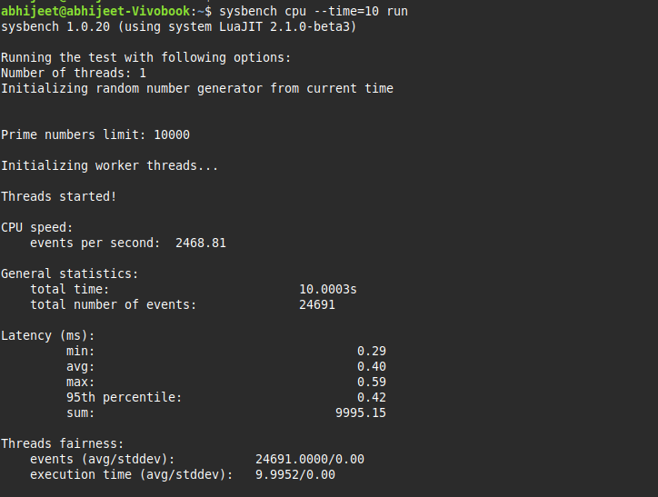

Day 2

### Install and Verify bpftrace

**sudo apt install bpftrace bpfcc-tools**
**bpftrace -V**

### KEY METRICS TO COLLECT 

1. **CONTEXT SWITCH**(SCHEDULER OVERHEAD)

Testing a ebpf script to check if it works 
**sudo bpftrace -e 'tracepoint:sched:sched_switch { @[comm] = count(); }'**
Run for ~10 seconds, then hit Ctrl+C.
This should show how many context switches happened per process.
A **context switch** happens when the **operating system switches the CPU from running one process (thread) to running** **another The CPU can only execute one thread per core at a time.**

When multiple processes/threads are waiting, the scheduler decides which one runs next.
To make the switch, the OS must save the current process’s state (registers, program counter, etc.) and load the next process’s state.
This operation is called a context switch.

2. **workload intensity**(SYSCALLS/SEC PER PROCESS)
**sudo bpftrace -e 'tracepoint:syscalls:sys_enter_* { @[comm] = count(); }'**

3. **Throughput** The amount of work the system completes per unit time.
Example: requests/second, transactions/second, jobs completed/minute.
Benchmarks (e.g., sysbench cpu gives “events per second”).

**sysbench cpu --time=10 run** 

For servers: number of HTTP requests/sec handled.

4. **CPU UTILIZATION** Fraction of CPU cycles being used (per core).
measured using mpstat, pidstat, top, or telemetry via eBPF.
Shows if CPU is bottlenecked (100%) or underutilized (<50%).

5. **Runnable Queue Length** Number of processes waiting for CPU time.
measured using vmstat 1 → “r” column.
eBPF probes: trace sched_wakeup / sched_switch.

Why it matters:
High queue length = more demand than CPU supply.

Interpretation:
If queue length ≈ number of cores → system is busy but balanced.
If queue length ≫ cores (e.g., 16 waiting on 4 cores) → contention, possible slowdown.

6. **Mean Latency**The average time it takes to complete a request/job.
Example: average response time of a query.
Measured using Benchmarks like fio report average latency per I/O.

Sysbench also outputs average latency.
Why it matters: Low average latency = fast system response.

Interpretation:
Averages can hide spikes — always check percentiles too.
Acceptable latency depends on workload (interactive apps want <100ms).

### for now lets take 6 other we will see later 